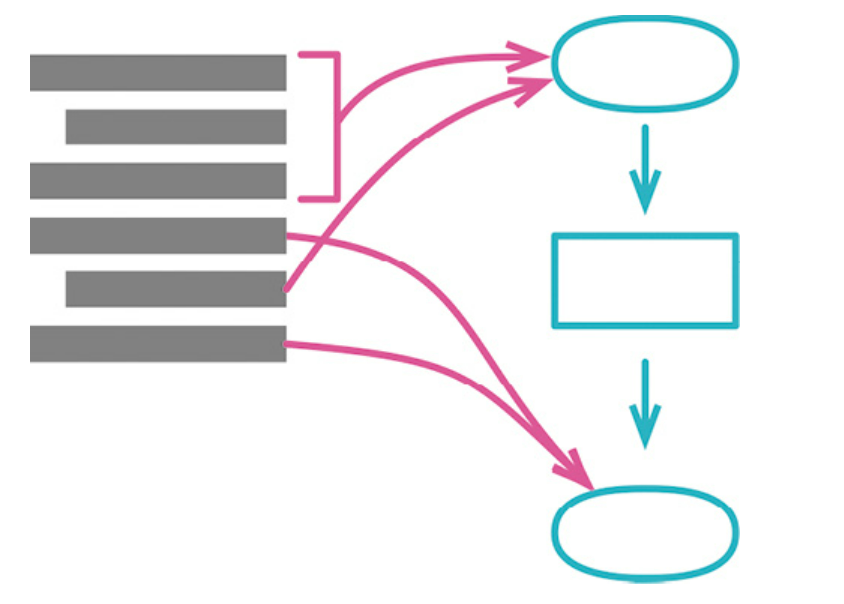

# 拆分阶段



对于大函数进行提炼，势必会将函数分解成独立的子逻辑，这一子逻辑就很想拆分阶段。

那么拆分阶段是什么呢？

个人理解是从逻辑层面看函数处理逻辑，逻辑之间通过中转数据串起来，形成解耦。

这一好处在于，不仅拆掉了子逻辑函数，也拆掉了子阶段。从这个层面看，阶段像是更高层次的提炼函数。

当然，阶段同提炼函数一样也可复用。

这里示例如：
```
statementData := statementData{
    customer:           customer,
    performances:       performances,
    totalAmount:        totalAmount(performances),
    totalVolumeCredits: totalVolumeCredits(performances),
}

return renderPlainText(statementData)
```

将计算逻辑与渲染逻辑分开，实现渲染逻辑拆分，这里可以将数据渲染成文本也可渲染成 `html`。

